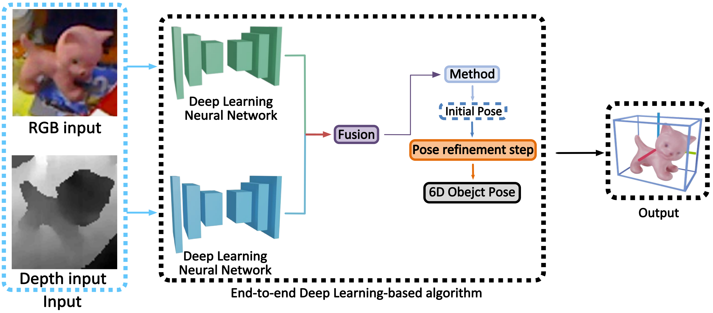

# A review on instance-level 6D object pose estimation
## Abstract
6D object pose estimation of rigid objects has received increasing attention in computer vision communities, which brings broad applications in robotics, augmented reality, autonomous driving, etc. Existing 6D object pose estimation methods can be divided into two categories by their semantic level: instance-level or category-level. In particular, instance-level 6D pose estimation goes further beyond object category semantics and focuses per-object perception. It opens up a wide applications in robotic manipulation and grasping. This paper mainly review, analyze and summarize the prior-art methods on instance-level 6D object pose estimation based on deep neural networks. First, we introduce a taxonomy of 6D object pose estimation methods based on input types and network characteristics. Secondly, we implement these methods by training on the unified benchmarks, e.g., LIMEMOD, and analyze the quantitative and qualitative results, with a summary of the major advantages and disadvantages of exiting backbones, modules and designs. Finally, we will examine potential avenues for future research, which we hope can be used as a guidance for practitioners working on 6D object pose estimation.

- [[Semester Thesis](./A_review_on_instance_level_6D_object_pose_estimation.pdf)] A review on instance-level 6D object pose estimation (Note: 1.3/1.0)

- Future research direction: End-to-end Deep Learning-based Method with Refinement

-0.1).png")

# Pose-Estimation-Paper-List
-A list of papers, libraries and datasets
-Code Provided by this [[git](https://github.com/yinyunie/3D-Shape-Analysis-Paper-List)]

---
- [Pose Estimation](#Pose-Estimation)
- [Others](#Ohters)
---

Statistics: :fire: code is available & stars >= 100  |  :star: citation >= 50

<!-- - [[Arxiv](https)] PoseCNN [[GitHub](https)] [[Project](https)] :fire: :star: -->

## Pose Estimation

#### Before 2022
- [[CVPR 2022](https://arxiv.org/pdf/2203.13254.pdf)] EPro-PnP: Generalized End-to-End Probabilistic Perspective-n-Points for Monocular Object Pose Estimation
- [[CVPR 2022](https://arxiv.org/pdf/2205.12257)] OnePose: One-Shot Object Pose Estimation without CAD Models [[GitHub](https://github.com/zju3dv/OnePose)] [[Project](https://zju3dv.github.io/onepose/)]:fire:
- [[CVPR 2022](https://arxiv.org/pdf/2203.05334v1)] ICG: Fusing Region and Depth for Highly Efficient 3D Tracking of Textureless Objects [[GitHub](https://github.com/DLR-RM/3DObjectTracking)] :fire:
- [[CVPR 2022](https://arxiv.org/pdf/2203.17234.pdf)] Templates for 3D Object Pose Estimation Revisited: Generalization to New Objects and Robustness to Occlusions
- [[CVPR 2022](https://arxiv.org/pdf/2203.12870.pdf)] RNNPose: Recurrent 6-DoF Object Pose Refinement with Robust Correspondence Field Estimation and Pose Optimization
- [[CVPR 2022](https://arxiv.org/pdf/2203.01072.pdf)] OVE6D: Object Viewpoint Encoding for Depth-based 6D Object Pose Estimation
- [[CVPR 2022](https://arxiv.org/pdf/2205.12257.pdf)] OnePose: One-Shot Object Pose Estimation without CAD Models
- [[CVPR 2022](https://arxiv.org/pdf/2110.11636.pdf)] Occlusion-Robust Object Pose Estimation with Holistic Representation
- [[CVPR 2022](https://arxiv.org/pdf/2204.09429.pdf)] HRPose: Real-Time High-Resolution 6D Pose Estimation Network Using Knowledge Distillation
- [[CVPR 2022](https://arxiv.org/pdf/2204.10776.pdf)] Gen6D: Generalizable Model-Free 6-DoF Object Pose Estimation from RGB Images
- [[ECCV 2022](https://arxiv.org/pdf/2104.02527.pdf)] RCVPose: Vote from the Center: 6 DoF Pose Estimation in RGB-D Images by Radial Keypoint Voting
- [[arxiv 2022](https://arxiv.org/abs/2203.07918)] GPV-Pose: Category-level Object Pose Estimation via Geometry-guided Point-wise Voting [[GitHub](https://github.com/lolrudy/GPV_Pose)]
- [[ICRA 2022](https://arxiv.org/pdf/2203.01929)] CenterSnap: Single-Shot Multi-Object 3D Shape Reconstruction and Categorical 6D Pose and Size Estimation [[GitHub](https://github.com/zubair-irshad/CenterSnap)] :fire:
- [[IEEE 2022](https://ieeexplore.ieee.org/document/9682507)] VisuoTactile 6D Pose Estimation of an In-Hand Object Using Vision and Tactile Sensor Data
- [[ICRA 2022](https://arxiv.org/pdf/2109.06161.pdf)] Single-Stage Keypoint-Based Category-Level Object Pose Estimation from an RGB Image
- 
#### Before 2021
- [[ICCV 2021](https://arxiv.org/abs/2109.10115v2)] StereOBJ-1M: Large-scale Stereo Image Dataset for 6D Object Pose Estimation
- [[Arxiv 2021](https://arxiv.org/abs/2111.00190)] Leveraging SE(3) Equivariance for Self-Supervised Category-Level Object Pose Estimation [[Project](https://dragonlong.github.io/equi-pose)]
- [[CVPR 2021](https://arxiv.org/pdf/2102.12145)] GDR-Net: Geometry-Guided Direct Regression Network for Monocular 6D Object Pose Estimation [[GitHub](https://github.com/THU-DA-6D-Pose-Group/GDR-Net)] :fire: :star:
- [[CVPR2021](https://arxiv.org/pdf/2103.02242)] FFB6D: A Full Flow Bidirectional Fusion Network for 6D Pose Estimation [[GitHub](https://github.com/ethnhe/FFB6D)] :fire: 
- [[CVPR 2021](https://arxiv.org/pdf/2110.04411.pdf)] Unsupervised Pose-Aware Part Decomposition for 3D Articulated Objects
- [[CVPR 2021](https://arxiv.org/pdf/2102.09334.pdf)] StablePose: Learning 6D Object Poses from Geometrically Stable Patches
- [[ICCV 2021](https://arxiv.org/pdf/2108.08367.pdf)] SO-Pose: Exploiting Self-Occlusion for Direct 6D Pose Estimation
- [[ICCV 2021](https://arxiv.org/pdf/2104.00633.pdfQD)] RePOSE: Fast 6D Object Pose Refinement via Deep Texture Rendering
- [[IEEE 2021](https://arxiv.org/pdf/2010.12807.pdf)] REDE: End-to-end Object 6D Pose Robust Estimation Using Differentiable Outliers Elimination
- [[IEEE 2021](https://ieeexplore.ieee.org/document/9361135)] Optimizing RGB-D Fusion for Accurate 6DoF Pose Estimation
- [[ICLR 2021](https://arxiv.org/pdf/2101.12378.pdf)] NeMo: Neural Mesh Models of Contrastive Features for Robust 3D Pose Estimation
- [[IEEE 2021](https://arxiv.org/pdf/2002.00911.pdf)] L6DNet: Light 6 DoF Network for Robust and Precise Object Pose Estimation with Small Datasets
- [[IROS 2021](https://arxiv.org/pdf/2109.10127.pdf)] KDFNet: Learning Keypoint Distance Field for 6D Object Pose Estimation
- [[IEEE 2021](https://arxiv.org/pdf/2104.07528.pdf)] Investigations on Output Parameterizations of Neural Networks for Single Shot 6D Object Pose Estimation
- [[CVPR 2021](https://arxiv.org/pdf/2103.07054.pdf)] FS-Net: Fast Shape-based Network for Category-Level 6D Object Pose Estimation with Decoupled Rotation Mechanism
- [[ECCV 2021](https://arxiv.org/pdf/2107.12549.pdf)] DISP6D: Disentangled Implicit Shape and Pose Learning for Scalable 6D Pose Estimation
- [[IROS2 2021](https://arxiv.org/pdf/2108.08755.pdf)] Category-Level 6D Object Pose Estimation via Cascaded Relation and Recurrent Reconstruction Networks
- [[CVPR 2021](https://arxiv.org/pdf/2108.00516.pdf)] BundleTrack: 6D Pose Tracking for Novel Objects without Instance or Category-Level 3D Models
- [[arXiv 2021](https://arxiv.org/pdf/1905.06658.pdf)] Vision-based Robotic Grasping From Object Localization, Object Pose Estimation to Grasp Estimation for Parallel Grippers
- [[IEEE 2021](https://ieeexplore.ieee.org/document/9561404)] 6D Object Pose Estimation with Pairwise Compatible Geometric Features

#### Before 2020
- [[CVPR 2020](https://arxiv.org/abs/1809.1079)] PVN3D: A Deep Point-wise 3D Keypoints Voting Network for 6DoF Pose Estimation [[GitHub](https://github.com/ethnhe/PVN3D)] :fire: :star:
- [[CVPR 2020](https://openaccess.thecvf.com/content_CVPR_2020/papers/Song_HybridPose_6D_Object_Pose_Estimation_Under_Hybrid_Representations_CVPR_2020_paper.pdf)] HybridPose: 6D Object Pose Estimation under Hybrid Representations [[GitHub](https://github.com/chensong1995/HybridPose)] :fire: :star:
- [[IEEE 2020](https://arxiv.org/abs/1910.10750)] 6-PACK: Category-level 6D Pose Tracker with Anchor-Based Keypoints [[GitHub](https://github.com/j96w/6-PACK)] [[Project](https://sites.google.com/view/6packtracking)] :fire: :star:
- [[IEEE 2020](https://arxiv.org/pdf/1902.02394.pdf)] Real-time 3D Traffic Cone Detection for Autonomous Driving
- [[arXiv 2020](https://arxiv.org/pdf/1812.11788.pdf)] PVNet: Pixel-wise Voting Network for 6DoF Pose Estimation

#### Before 2019
- [[CVPR 2019](https://arxiv.org/abs/1901.04780)] DenseFusion: 6D Object Pose Estimation by Iterative Dense Fusion [[GitHub](https://github.com/j96w/DenseFusion)]  [[Project](https://sites.google.com/view/densefusion/)] :fire: :star:
- [[CoRL 2018](https://arxiv.org/abs/1809.10790)] Deep Object Pose Estimation for Semantic Robotic Grasping of Household Objects[[GitHub](https://github.com/NVlabs/Deep_Object_Pose)]  :fire: :star:
- [[ECCV 2018](https://arxiv.org/pdf/1804.00175v4.pdf)] DeepIM: Deep Iterative Matching for 6D Pose Estimation [[GitHub](https://github.com/NVlabs/DeepIM-PyTorch)] [[Project](https://rse-lab.cs.washington.edu/projects/deepim/)] :fire: :star:
- [[Arxiv 2017](https://arxiv.org/abs/1711.00199)] PoseCNN: A Convolutional Neural Network for 6D Object Pose Estimation in Cluttered Scenes [[GitHub](https://github.com/NVlabs/PoseCNN-PyTorch)] [[Project](https://rse-lab.cs.washington.edu/projects/posecnn/)] :fire: :star:
- [[CVPR 2022](https://ieeexplore.ieee.org/document/9009519)] CDPN: Coordinates-Based Disentangled Pose Network for Real-Time RGB-Based 6-DoF Object Pose Estimation

#### Survey-Review
- [[Survey 2022](https://tuprints.ulb.tu-darmstadt.de/21027/)] A Survey of 6D Object Detection Based on 3D Models for Industrial Applications 
- [[IEEE 2022](https://ieeexplore.ieee.org/document/9836663)] A Review of 6D Object Pose Estimation 

- [[Springer 2021](https://journalofbigdata.springeropen.com/articles/10.1186/s40537-021-00444-8)] Review of deep learning: concepts, CNN architectures, challenges, applications, future directions 
- [[ArXiv 2020](https://arxiv.org/abs/1905.06658)] Vision-based Robotic Grasping From Object Localization, Object Pose Estimation to Grasp Estimation for Parallel Grippers: A Review 
- [[ArXiv 2020](https://arxiv.org/abs/2009.07378)] BOP Challenge 2020 on 6D Object Localization
- [[ArXiv 2020](https://arxiv.org/pdf/2001.10609.pdf)] A Review on Object Pose Recovery: from 3D Bounding Box Detectors to Full 6D Pose Estimators  
- [[ArXiv 2019](https://www.researchgate.net/publication/344765943_Survey_on_6D_Pose_Estimation_of_Rigid_Object)] Survey on 6D Pose Estimation of Rigid Object 
- [[ArXiv 2019](https://arxiv.org/abs/1903.04229)] Instance- and Category-level 6D Object Pose Estimation 
- [[IEEE 2019](https://ieeexplore.ieee.org/stamp/stamp.jsp?arnumber=9543652)] A Comprehensive Review on 3D Object Detection
and 6D Pose Estimation With Deep Learning 
- [[Springer 2019](https://link.springer.com/book/10.1007/978-3-030-30754-7)] New Trends in Image Analysis and Processing – ICIAP 2019
- [[Springer 2017](https://jwcn-eurasipjournals.springeropen.com/articles/10.1186/s13638-017-0993-1)] Text feature extraction based on deep learning: a review
- [[Springer 2016](https://link.springer.com/chapter/10.1007/978-3-319-49409-8_52)] On Evaluation of 6D Object Pose Estimation
- [[IEEE 2016](https://ieeexplore.ieee.org/document/7368948)] Pose Estimation for Augmented Reality: A Hands-On Survey
---

## Ohters(Datasets)

#### Before 2022

#### Before 2021
- [[TOG 2019](https://arxiv.org/pdf/1801.07829.pdf)] Dynamic Graph CNN for Learning on Point Clouds [[Project](https://liuziwei7.github.io/projects/DGCNN)] :fire: :star:

---

